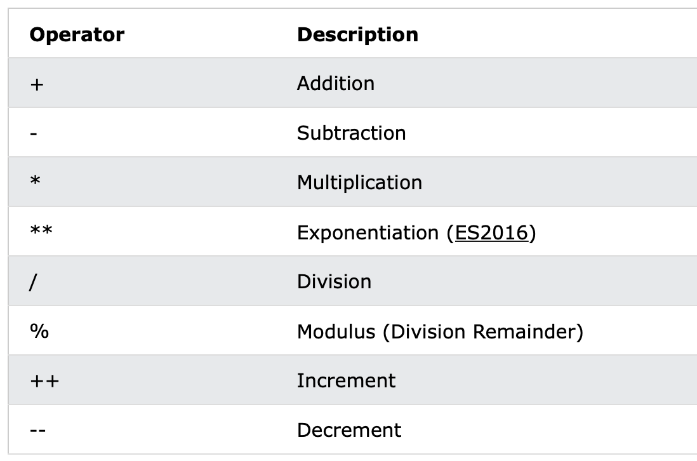
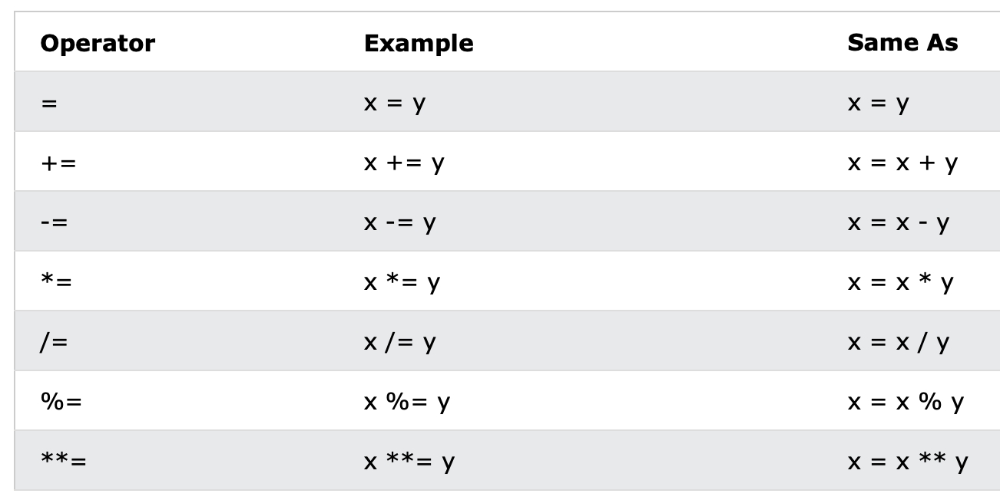
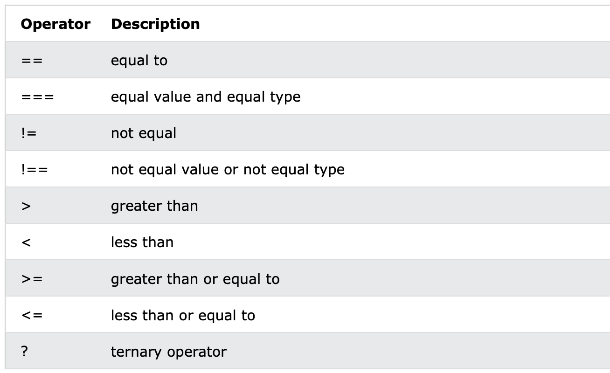

## JavaScript Where To

### The <script> Tag

In HTML, JavaScript code is inserted between `<script>` and `</script>` tags.

```javascript
<script>
document.getElementById("demo").innerHTML = "My First JavaScript";
</script>
```


### JavaScript in <head> or <body>

Scripts can be placed in the `<body>`, or in the `<head>` section of an HTML page, or in both.


### External JavaScript

```html
<script src="myScript.js"></script>
```

To add several script files to one page - use several script tags:

```html
<script src="myScript1.js"></script>
<script src="myScript2.js"></script>
```


## JavaScript Output

* Writing into an HTML element, using `innerHTML`.
* Writing into the HTML output using `document.write()`.
* Writing into an alert box, using `window.alert()`.
* Writing into the browser console, using `console.log()`.

### Using document.write( )

Using document.write() after an HTML document is loaded, will **delete all existing HTML**:

### Example

```html
<!DOCTYPE html>
<html>
<body>

<h1>My First Web Page</h1>
<p>My first paragraph.</p>

<button type="button" onclick="document.write(5 + 6)">Try it</button>

</body>
</html>
```

### Using window.alert()

You can skip the `window` keyword.

In JavaScript, the window object is the global scope object. This means that variables, properties, and methods by default belong to the window object. This also means that specifying the `window` keyword is optional.

## JavaScript Statements

## Semicolons ;

Semicolons separate JavaScript statements.

Add a semicolon at the end of each executable statement


## JavaScript White Space

JavaScript ignores multiple spaces. You can add white space to your script to make it more readable.

The following lines are equivalent:

```javascript
let person = "Hege";
let person="Hege";
```


### JavaScript Line Length and Line Breaks

For best readability, programmers often like to avoid code lines longer than 80 characters.

If a JavaScript statement does not fit on one line, the best place to break it is after an operator:

```javascript
document.getElementById("demo").innerHTML =
"Hello Dolly!";
```


### JavaScript Keywords

JavaScript statements often start with a **keyword** to identify the JavaScript action to be performed.

https://www.w3schools.com/js/js_statements.asp


## JavaScript Syntax

### JavaScript Values

The JavaScript syntax defines two types of values:

* fixed values
* Variable values

Fixed values are called **Literals**. Variable values are called **Variables**.

### JavaScript Literals

**Numbers** are written with or without decimals: 

```javascript
10.50
1001
```

 **Strings** are text, written within double or single quotes: 

```javascript
"John Doe"
'John Doe'
```


### JavaScript Variables

In a programming language, **variables** are used to **store** data values.

JavaScript uses the keywords `var`, `let` and `const` to **declare** variables.

An **equal sign** is used to **assign values** to variables.


### JavaScript Expressions

An expression is a combination of values, variables, and operators, which computes to a value.

The computation is called an evaluation.

For example, 5 * 10 evaluates to 50:

```javascript
5 * 10
```

Expressions can also contain variable values:

```javascript
x * 10
```


### JavaScript Keywords

JavaScript **keywords** are used to identify actions to be performed.

The `let` keyword tells the browser to create variables:

```javascript
let x, y;
x = 5 + 6;
y = x * 10;
```

The `var` keyword also tells the browser to create variables:

```javascript
var x, y;
x = 5 + 6;
y = x * 10;
```


### JavaScript Comments

Not all JavaScript statements are "executed".

Code after double slashes `//` or between `/*` and `*/` is treated as a **comment**.

```javascript
let x = 5;   // I will be executed

// x = 6;   I will NOT be executed
```


### JavaScript Identifiers / Names

Identifiers are JavaScript names.

Identifiers are used to name variables and keywords, and functions.

The rules for legal names are the same in most programming languages.

A JavaScript name must begin with:

* A letter (A-Z or a-z)
* A dollar sign ($)
* Or an underscore (_)

Numbers are not allowed as the first character in names.

This way JavaScript can easily distinguish identifiers from numbers.


## JavaScript Variables

### 4 Ways to Declare a JavaScript Variable:

* Using `var`
* Using `let`
* Using `const`
* Using nothing

```javascript
//Using `var`
var x = 5;
var y = 6;
var z = x + y;
//Using `let`
let x = 5;
let y = 6;
let z = x + y;
//Using `const`
const price1 = 5;
const price2 = 6;
let total = price1 + price2;
//Using nothing
x = 5;
y = 6;
z = x + y;
```

### When to Use JavaScript var?

Always declare JavaScript variables with `var`,`let`, or`const`. The `var` keyword is used in all JavaScript code from 1995 to 2015. The `let` and `const` keywords were added to JavaScript in 2015. If you want your code to run in older browsers, you must use `var`.

### When to Use JavaScript const?

If you want a general rule: always declare variables with `const`. If you think the value of the variable can change, use `let`. In this example, `price1`, `price2`, and `total`, are variables:

### JavaScript Dollar Sign $

Using the dollar sign is not very common in JavaScript, but professional programmers often use it as an alias for the main function in a JavaScript library.

In the JavaScript library jQuery, for instance, the main function `$` is used to select HTML elements. In jQuery `$("p");` means "select all p elements".

## JavaScript Let

Variables defined with `let` cannot be Redeclared.

Variables defined with `let` must be Declared before use.

Variables defined with `let` have Block Scope.

### Cannot be Redeclared

```javascript
let x = "John Doe";
let x = 0;
// SyntaxError: 'x' has already been declared

var x = "John Doe";
var x = 0;
//With var you can
```

## Block Scope

Before ES6 (2015), JavaScript had only **Global Scope** and **Function Scope**.

ES6 introduced two important new JavaScript keywords: `let` and `const`.

These two keywords provide **Block Scope** in JavaScript.

Variables declared inside a { } block cannot be accessed from outside the block:

```javascript
{ 
  let x = 2;
}
// x can NOT be used here

//Variables declared with the var keyword can NOT have block scope.
//Variables declared inside a { } block can be accessed from outside the block.
{ 
  var x = 2; 
}
// x CAN be used here
```

### Redeclaring Variables

Redeclaring a variable using the `var` keyword can impose problems.

Redeclaring a variable inside a block will also redeclare the variable outside the block:

```javascript
var x = 10;
// Here x is 10
{ 
var x = 2;
// Here x is 2
}
// Here x is 2
```

Redeclaring a variable using the `let` keyword can solve this problem.

Redeclaring a variable inside a block will not redeclare the variable outside the block:

```javascript
let x = 10;
// Here x is 10
{
let x = 2;
// Here x is 2
}
// Here x is 10
```

### Let Hoisting

Variables defined with `var` are **hoisted** to the top and can be initialized at any time.

Meaning: You can use the variable before it is declared:

```javascript
carName = "Volvo";
var carName;
//it's ok
```

If you want to learn more about hoisting, study the chapter [JavaScript Hoisting](https://www.w3schools.com/js/js_hoisting.asp).

Variables defined with `let` are also hoisted to the top of the block, but not initialized.

Meaning: Using a `let` variable before it is declared will result in a `ReferenceError`:

```javascript
carName = "Saab";
let carName = "Volvo";
//it's not ok
```

## JavaScript Const

Variables defined with `const` cannot be Redeclared.

Variables defined with `const` cannot be Reassigned.

Variables defined with `const` have Block Scope.

### Cannot be Reassigned

```javascript
const PI = 3.141592653589793;
PI = 3.14;      // This will give an error
PI = PI + 10;   // This will also give an error
```

### Must be Assigned

```javascript
const PI = 3.14159265359;
//ok

const PI;
PI = 3.14159265359;
//not ok
```

### Block Scope

Declaring a variable with `const` is similar to `let` when it comes to **Block Scope**.

The x declared in the block, in this example, is not the same as the x declared outside the block:

```javascript
const x = 10;
// Here x is 10
{ 
const x = 2;
// Here x is 2
}
// Here x is 10
```

## JavaScript Operators

### Arithmetic Operators



### JavaScript Assignment Operators



### JavaScript Comparison Operators


